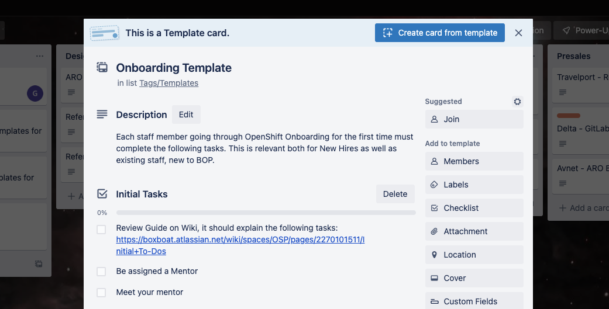

+++
title = "Initial To-Dos"
slug = "initial-to-dos"
weight = 2
description = '''
Start here for BOP Onboarding
'''
+++
## Intro and Welcome!
So, you’re a new hire at BoxBoat (Congratulations!!) and you want to get started with OpenShift and BOP? Or perhaps you’ve been at BoxBoat awhile, but haven’t yet explored anything on the OpenShift side? This page is for you!

Following the tasks on this page will enable you to begin your journey within BOP by: receiving access to any needed accounts, finding the right channels and pages for learning more or asking help, learning the lingo and abbreviations (like what’s a [BOP]()?), figuring out how to get hands-on with OCP, and more! 

## BOP Onboarding Tasks

### First Steps
Before you really dive into the material within the wiki and elsewhere, it is necessary that you first complete a few initial tasks. While the rest of the materials can be performed at your own pace and in whatever order you prefer, the actions in this section will enable you to proceed with Onboarding.

1. Create your Partner Portal Account(s) - this is the root of all information and training from Red Hat. Going forward, I recommend everyone create an IBM-RH Partner Account and perform any and all training there. This simplifies the process of logging the time and crediting accreditations. You may still create a BoxBoat-RH account as desired for NFRs and other such uses.

    1. Create an IBM-RH Account [Creating Red Hat Accounts - IBM](https://w3.ibm.com/w3publisher/redhat/synergy/partnerconnect)
    2. ( _Optional_ ) Create a BoxBoat-RH Account [Creating your Partner Portal Account]()

1. Join the BOP Trello Board:

    1. [Sign-up](https://w3.ibm.com/#/support/article/trello_at_ibm/trello_get_started) for Trello with your **IBM email** 
    2. Join the [BoxBoat/HCS Workspace](https://trello.com/invite/boxboathcs/364e6ee5aa4ecbbacf1d37f0e49dd912)
    3. Join the [BOP Trello Board](https://trello.com/b/eJOUMUdm)
    4. Create an Onboarding Ticket for yourself
    5. Click on Onboarding Template card, _create card from template_
    6. Move your card under the Onboarding Column

1. ( _Optional_ ) Obtain a free [RHEL Developer Subscription](https://developers.redhat.com/blog/2016/03/31/no-cost-rhel-developer-subscription-now-available)

    1. In order to get access to the RH KB, support, and other similar paywall content, you will need a license associated with your account. The RHEL Dev Subscription is the quickest way to do this.
    2. Note, it may take 24h or more after sign-up for your access to sync across all environments.

2. Do an initial review of the [Terms, Abbreviations, and Definitions]() page to familiarize yourself with the ecosystem. Don’t worry about the technical specifics yet, but understand OCP vs OpenShift and other terms.

1. Join BoxBoat OpenShift Slack channels

    1. [#eng-openshift-onboarding](https://boxboat.slack.com/archives/C02SYSWDZEX)
    2. [#eng-openshift](https://boxboat.slack.com/archives/C6A002Q0L)

2. Review the materials on [Hybrid Onboarding Curriculum]() and begin working through your assigned materials! Alternatively, if you haven’t been assigned any specifically, follow the curriculum listed on the linked page.

    1. If you’ve already Onboarded to BoxBoat previously and are looking for a deeper OpenShift Onboarding, then chek out the rest of BOP Onboarding for more materials, such as the [Full Curriculum](https://docs.google.com/document/d/1eTTARqkL0Gm4lCrzMkbl2KGC_XOtGxO9tBrp7AtlwmM/edit?usp=sharing).

3. Review the various technical resources at [OpenShift Technical Resources](). Consider picking a few which capture your interest, or which your next engagement involves, and do a deep dive into the materials. Also, if a specific integration has not yet been populated, consider doing so!

1. Go try OpenShift with these instructions! [Trying OpenShift]()

1. Keep digging into the resources on the Partner Portal, RH Blog, etc. There are so many facets to OCP, no one can know it all!

*****

[[category.storage-team]] 
[[category.confluence]] 
