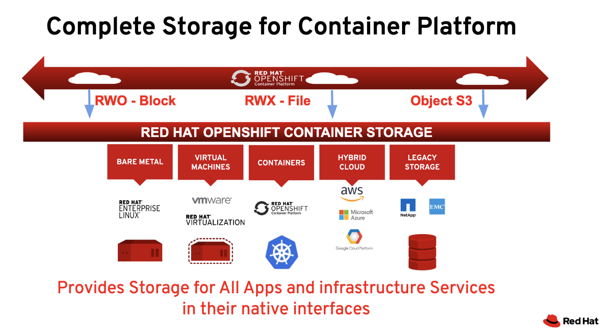
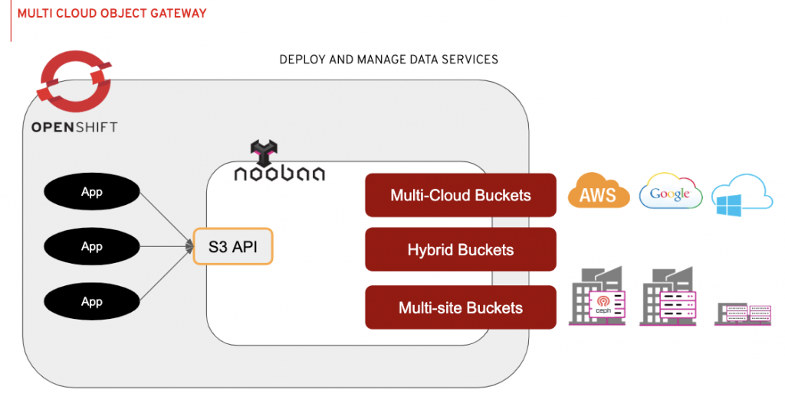

+++
title = "Storage"
weight = 1
description = '''
'''
+++

## OpenShift Storage

## CSI

### Snapshotting

- [A Technical Overview of VolumeSnapshotMover](https://cloud.redhat.com/blog/a-technical-overview-of-volumesnapshotmover)

See [OADP]()  for more information.

## OCS/ODF

### OpenShift Container Storage (OCS)

{}
OCS has been migrated into ODF. See below.
{}

### OpenShift Data Foundation (ODF)

ODF is a clustered storage solution for OpenShift, consisting of the following components:
- Ceph (Rook)
- Noobaa

#### Ceph

#### Noobaa

## References

- [OpenShift Commons Briefing: State of OpenShift Container Storage – Eran Tamir and Duncan Hardie (Red Hat)](https://cloud.redhat.com/blog/state-of-openshift-container-storage-eran-tamir-and-duncan-hardie-red-hat)
- [Introducing Multi-Cloud Object Gateway for OpenShift](https://cloud.redhat.com/blog/introducing-multi-cloud-object-gateway-for-openshift)
- [A Guide for Creating a Separate-disk Partition at Installation Time](https://cloud.redhat.com/blog/a-guide-to-creating-a-separate-disk-partition-at-installation-time)