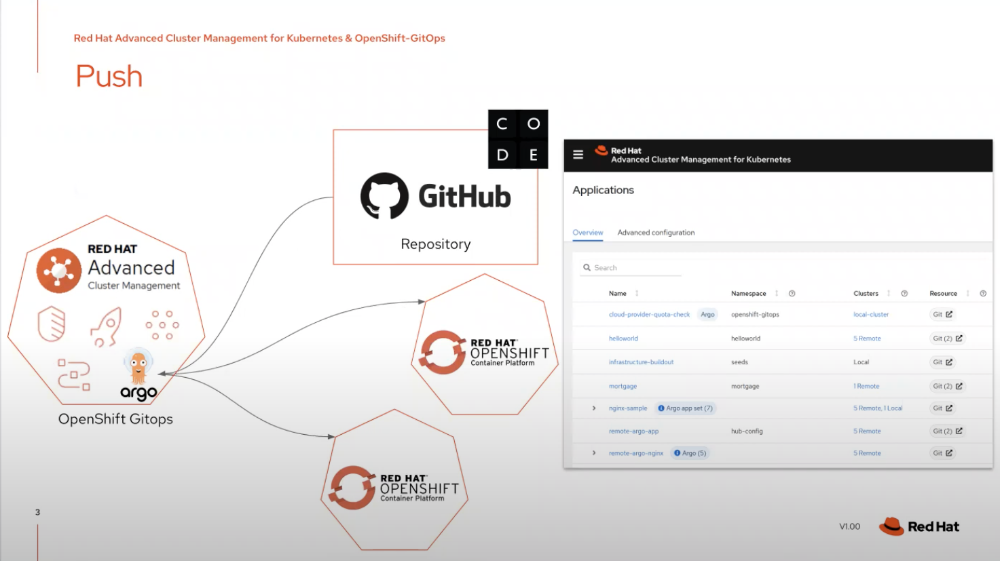
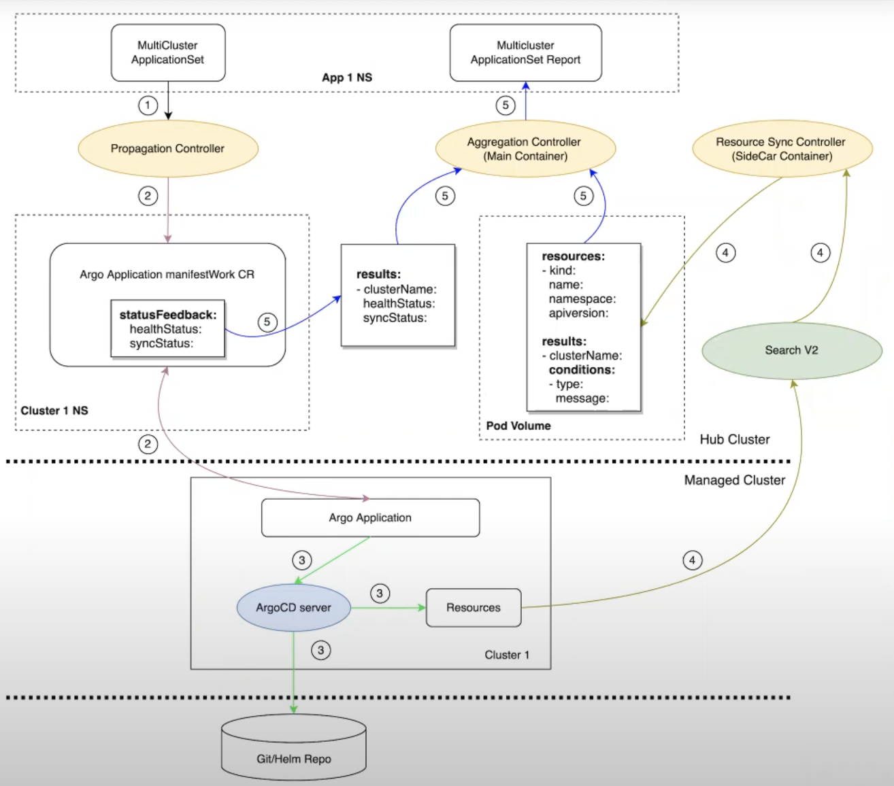
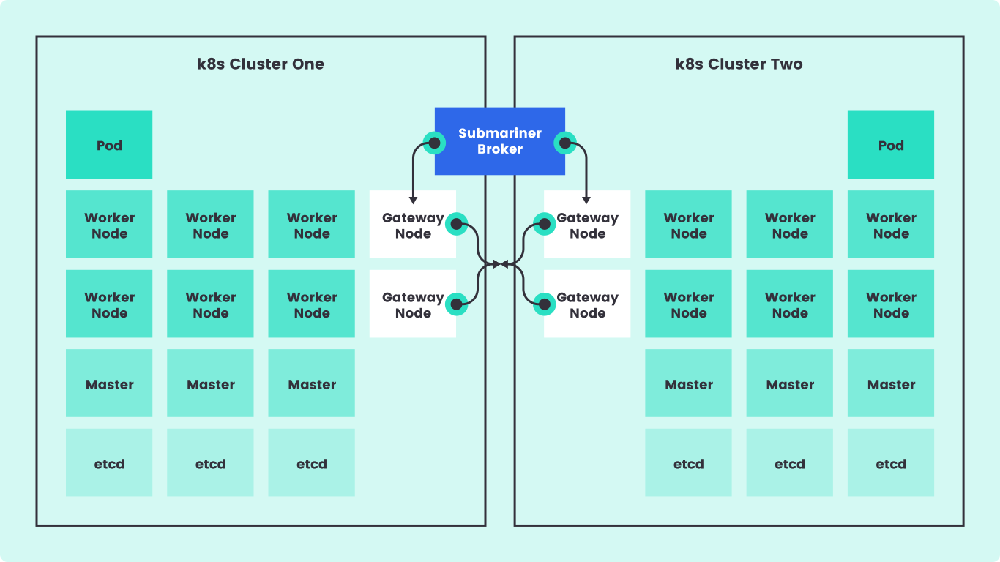

+++
title = "RHACM"
weight = 9
categories = ["Technical", "Integrations"]
description = '''
Red Hat Advanced Cluster Management
'''
+++

## What is it?

Red Hat Advanced Cluster Management

 **RHACM** takes the venerated hub-spoke architecture and brings it to Kubernetes and the containerized world. It provides visibility and control of a multi-cluster Kubernetes environment from within the centralized console of your primary OCP cluster. Utilizing a slew of industry tools, such as Ansible, ArgoCD, etc, RHACM allows standardizing policies and deployments across distributed ecosystems.

## Red Hat’s Description

Red Hat Advanced Cluster Management for Kubernetes controls clusters and applications from a single console, with built-in security policies. Extend the value of Red Hat OpenShift by deploying apps, managing multiple clusters, and enforcing policies across multiple clusters at scale. Red Hat’s solution ensures compliance, monitors usage, and maintains consistency.

## Core Upstream Technology

* [OCM Project page](https://open-cluster-management.io/)

### Additional GitHub links

* [OCM ](https://github.com/open-cluster-management-io)
* ACM implementation of OCM - [Stolostron ](https://github.com/stolostron)

## Documentation

### Product Page

* [RHACM Product Page](https://www.redhat.com/en/technologies/management/advanced-cluster-management)

### Access Documentation

* [RH Access Documentation](https://access.redhat.com/documentation/en-us/red_hat_advanced_cluster_management_for_kubernetes/2.5/html/about/welcome-to-red-hat-advanced-cluster-management-for-kubernetes)

### Technical Deep Dive

### Guides and Demos

{}

{}
{}

{}
{}

{}
{}

{}

## Technical Components

### Multi-cluster

#### Submariner

* [Connecting Multi-cluster Overlay Networks](https://rcarrata.com/openshift/rhacm-submariner/)

#### Istio/Service Mesh

See [OCP Service Mesh]()  for more information.

* [Set up Istio Multicluster with Submariner in Red Hat Advanced Cluster Management for Kubernetes](https://cloud.redhat.com/blog/set-up-istio-multicluster-with-submariner-in-red-hat-advanced-cluster-management-for-kubernetes)

### OCM vs Cluster API

* **Cluster API** - Handles Day 1 Ops, such as provisioning a cluster.
* **OCM**  - Handles Day 2 Ops, such as managing and deploying workloads to clusters, building multi-cluster solutions, etc.
* [OCM - ClusterAPI Integration ](https://github.com/open-cluster-management-io/OCM/tree/main/solutions/cluster-api)



## Relevant Courses

### Partner Portal

### Community

* [OCM Slack channel](https://kubernetes.slack.com/channels/open-cluster-mgmt) in Kubernetes Workspace - [Sign-up here](https://communityinviter.com/apps/kubernetes/community) for K8s Slack
* [OCM YT Channel](https://www.youtube.com/c/OpenClusterManagement)

## Articles

## Notes

## Other References

* [Using Red Hat Advanced Cluster Management (ACM) for Kubernetes](https://community.intel.com/t5/Blogs/Tech-Innovation/Cloud/Hybrid-Multi-Cloud/post/1351227)
* [Using Red Hat OpenShift Data Foundation for Storage in a Multicloud Scenario - Intel Communities](https://community.intel.com/t5/Blogs/Tech-Innovation/Cloud/Using-Red-Hat-OpenShift-Data-Foundation-for-Storage-in-a/post/1382433)

## Reference Diagrams

