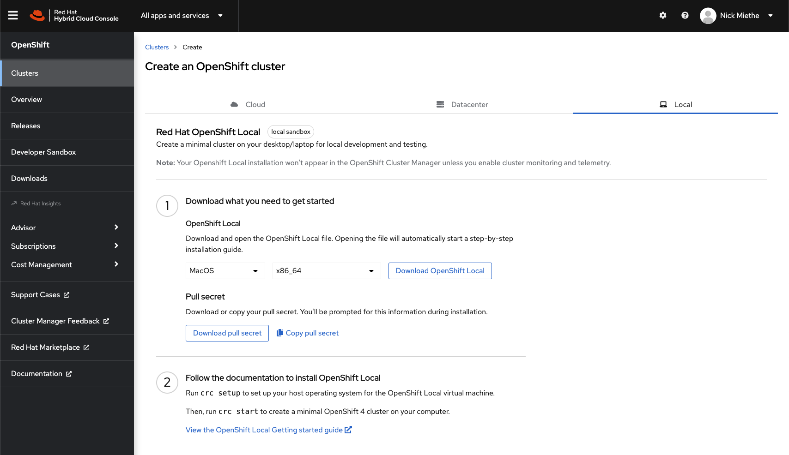

+++
title = "OpenShift Local"
weight = 3
description = '''
'''
+++

What is it?
-----------

[OpenShift Local](https://developers.redhat.com/products/openshift-local/overview), previously CodeReady Containers (CRC) is a distribution of OCP which is able to be run on your local machine, such as a laptop (albeit a well-specced one).

### Differences from OCP

In order for OpenShift Local to be capable of deploying on the minimum required HW, certain features have been removed from the default install, with other core differences made to the architecture. Notably, OCP Local uses a single node and runs in a VM on the host machine via the _libvirt_ package.

Find the other differences in the [documentation here](https://access.redhat.com/documentation/en-us/red_hat_openshift_local/2.5/html/getting_started_guide/introducing_gsg#differences-from-production-openshift-install_gsg).

### Requirements

[Documentation](https://access.redhat.com/documentation/en-us/red_hat_openshift_local/2.5/html/getting_started_guide/installation_gsg)  
OpenShift Local has the following minimum HW requirements:

**Runtime**

**Host Architecture**

**Min physical cores**

**Min RAM**

**Min Storage**

OpenShift Container Platform

Intel 64, AMD64

4

9GB

35GB

Podman Container runtime

ARM64

2

2GB

35GB

**Supported Host OS**

**Distros/Versions**

Windows

Windows 10 v1709 or later (no Home Edition)

macOS

Big Sur (11) or later

Linux

*   [Required Dependencies](https://access.redhat.com/documentation/en-us/red_hat_codeready_containers/2.5/html-single/getting_started_guide/#required-software-packages_gsg)
    
*   Latest 2 minor RHEL/CentOS of 7, 8, or 9.
    
*   Fedora Latest 2 Stable
    
*   Below not officially supported but may work:
    
    *   Ubuntu 18.04 LTS or later
        
    *   Debian 10 or later
        

### Install

[Install Docs](https://access.redhat.com/documentation/en-us/red_hat_openshift_local/2.5/html/getting_started_guide/installation_gsg#installing_gsg)

Deploying OpenShift Local is extremely easy. Before you start, make sure you have a [Red Hat Hybrid Cloud Console](https://console.redhat.com/) account. If you have already signed up for a Red Hat Partner Portal account and have your Red Hat SSO, you should be able to access the portal.

Once logged in and on the Hybrid Cloud Console, proceed to “Create an OpenShift Cluster” and click on the “Local” tab, as shown in the image below.

From there, follow the directions by downloading the OpenShift Local installation file and running the _setup_ and _start_ commands to provision and deploy you environment. Enjoy!